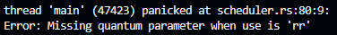

# Chat_GPT_Scheduler

### Usage
- To compile the program, use "rustc scheduler.rs"
- To run the code, use the compiled file + your .in file such as "./scheduler fcfs.in"
- The program will create a .out file of the same name as the .in file in the directory the .in file was in.

### Environment
I chose to use Google Gemini [(chat history here)](https://gemini.google.com/share/d034cc6cabb9) as my "ChatGPT" for this assignment.
The minimal human intervention I made was to slightly modify the strings being printed to screen/file to more closely align with the expected output.
I figured changing a space to a hyphen or fixing the name of the compiled file in the Usage Error wasn't significant enough to warrant an explanation to Gemini and a full regeneration (or partial regeneration) of working code.

## Correctness
The program generated by Gemini matched the provided output files in everything except minor formatting. It genereated "First Come First Served" when the provided files had "First Come First-Served". Additionally, I noticed that when running the program without a file in additional arguments that it said "Usage: scheduler-get" instead of "Usage: scheduler" as the name of the file would imply, but given I told it to do that in the instructions, it makes sense why it opted to do so. The only thing I noticed of significance during testing for bugs during the Completeness section that the program appears to crash (panics) when quantum is missing during Round Robin.

## Efficiency
Looking over the program, the code appears to be efficient, using structs to handle programs individually, and using a for loop to emulate time passing. The program comes out to a total of 175 lines of code, including  spacing and comments. It wrote the whole functioning program in a single file. This seems appropriate for the size of the task. I am unsure of unecessary code given I am not well versed in Rust's time to execute certain processes or compilation shortcuts (such as noticing the swapping of 2 variable and writing alternative assembly vs a slower literal translation), so I am not too certain if it could have a significant boost in performance or even less lines of code. Additionally, Gemini itself was very time efficient giving me a working program after just one prompt, minimizing the effort overall on going back and forth fixing errors or asking for more pieces. I did ask it to retry the first prompt once, as its first generation was only pieces of the full puzzle.

## Readability
Interestingly enough, compared to previous times using AI in assistance with writing code, I found there to be a distinct lack of comments in this program. Gemini only gave 6 total comments in the code. One was used to mark where Round Robin validation occured, and another was used to mark where preemption is handeled. The other 4 were used to clarify ordering of events i.e.
```
// 1. ...
code

// 2. ...
code

// 3. ...
code

// 4. ...
code
```
I noticed Gemini used snake_case for variables using more than one word. I am not sure if this is because of convention for Rust programming, or if Gemini favors this formatting, or simply by random chance. I noticed reasonable spacing between structs, functions, and code segments. As someone who is unfamiliar with Rust, I could tell where print statements were (whether to file or terminal), or where a for loop was, but it was definitely harder overall to read through and fully comprehend what was going on. 

## Completeness
- When giving the program an empty .in file, it producess a .out file with contents:
```
0 processes
Using Unknown
Finished at time 0
```
- When runnnig the program with no .in file, it succesfully tells the user about the usage of the file.
- When missing processcount in .in file, the output simply says there are 0 processes.
- When missing runfor in .in file, the output finishes at 0, and consequently, all processes fail to finish.
- When missing use in .in file, the out runs idle, noting when programs arrive, but never actually schedules them.
- When missing end in .in file, the program runs as usual.
- When a running process does not complete in the time given, it gives a burst amount greater than remaining time if the .in file says to, but does successfully state that the process did not finish.
- When missing the quantum during Round Robin, the program "panics", but does print the quantum Error.



It seems like the program handels edge cases well except for missing the quantum. Overall, the program is pretty complete.

## Learning Assistance
The only learning assistance I needed as an absolute beginner in rust was to simply install it and compile it. I asked Gemini how to do so after getting my first generated program, and it gave me sufficient instructions to install Rust in GitHub and to compile the program file. Because of the 'excellent' job that Gemini did, I did not *need* to change anything about the program, so I did not ask Gemini for assistance in learning Rust.

## Overall Quality
Overall I would say that Gemini showed mastery in Rust, provided a fully working program with little to no bugs, and was very easy to use in my experience. I only asked Gemini 2 times for the program itself, and only needed to ask it once for how to install and use Rust. This saved a massive amount of time; I took more time running the provided test files and looking for bugs than I did engineering the initial prompt and getting that working program. The lack of comments does leave the program harder to read what's happening. I would be happy to use Gemini again in the future should I need AI assistance for programming in Rust.